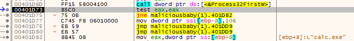
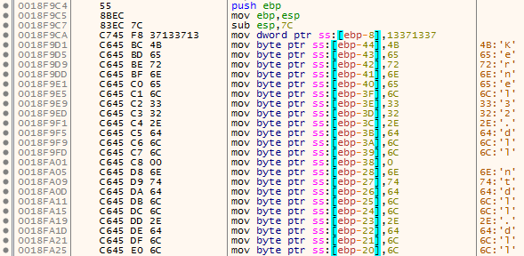
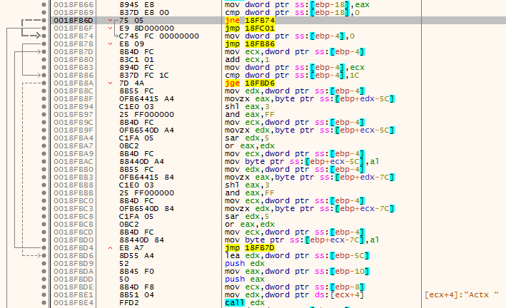
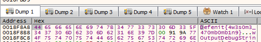

Defenit CTF 2020 had a reverse engineering chalenge, `Malicious Baby`, which was a Windows binary. The goal was to unpack it and get the flag, as the description tells us.
> Description: There is a malicious binary packed with a PE Packer I made for you. Your mission is unpacking the malware manually and recognizing the technique it uses.
File: MaliciousBaby.exe


## Dynamic analysis

Doing a `file` on the binary:

`MaliciousBaby.exe: MS-DOS executable`

Not too much information one that one. In IDA, there's only 4 functions, as we might expect from a packed binary. Looking at the imports, we have `LoadLibraryA`, `GetProcAddress`, `VirtuaProtect` and `ExitProcess`, which indicates the binary will dynamically resolve other functions. However, by running `strings`, we can see a bunch of functions that might be imported later.

```
HeapFree
SetLastError
GetCurrentProcess
WaitForMultipleObjects
GetProcessId
Thread32Next
Thread32First
SuspendThread
GlobalDeleteAtom
ResumeThread
GlobalGetAtomNameW
DuplicateHandle
GetModuleHandleA
GlobalAddAtomW
OpenProcess
CreateToolhelp32Snapshot
CreateEventW
Sleep
GetLastError
Process32NextW
SetEvent
GetCurrentThread
Process32FirstW
HeapReAlloc
[...]
```

Some functions lead us to a possible process injection (DLL injection, process hollowing, process Doppelgänging, etc.). Those functions are `Process32NextW`, `Process32FirstW`, `OpenProcess`, `CreateToolhelp32Snapshot` and so on. Particular functions in this list are `GlobalDeleteAtom`, `GlobalGetAtomNameW`, `GlobalAddAtomW`. One known method of injecting into a remote process is called `atom bombing` (https://www.enisa.europa.eu/publications/info-notes/atombombing-2013-a-new-code-injection-attack), we that just might be it.

As the binary will want to inject into a remote process, we will watch what process by hooking on `Process32NextW`, and will hook what's being injected by hooking `QueueUserAPC`, all using `xdbg`.



So, we can guess the binary is looking for a process `calc.exe`. Let's just open one and rerun the binary. It will the break on `QueueUserAPC`. By looking at the parameters, we can see one function address, `0x18F948` in our case. We can right-click and select `Follow DWORD in Disassembler`. It is in the middle of a function. By looking around the function, we can see one with suspicious instructions.



As we can see, it might again resolve dynamically some functions using stack strings. What is interesting is the string being transformed.



I didn't feel like reversing it or writing a python script so I just jumped on the beginning of the function (right-click and select `Set New Origin Here`), let the function push the strings then I jumped onto the beginning of the loop. I put a breakpoint on the `mov byte ptr ss:[ebp+ecx-7C],al` instruction to see what was there, as the byte being "decrypted" was pushed there. The first character was `D` and then `e`. That looked nice, and we got the flag.



## Summary
As the flag tells us, the process was doing `atom bombing`, but we didn't really care since we just hooked on interesting functions. That wasn't a really hard challenge, but was fun for sure!
